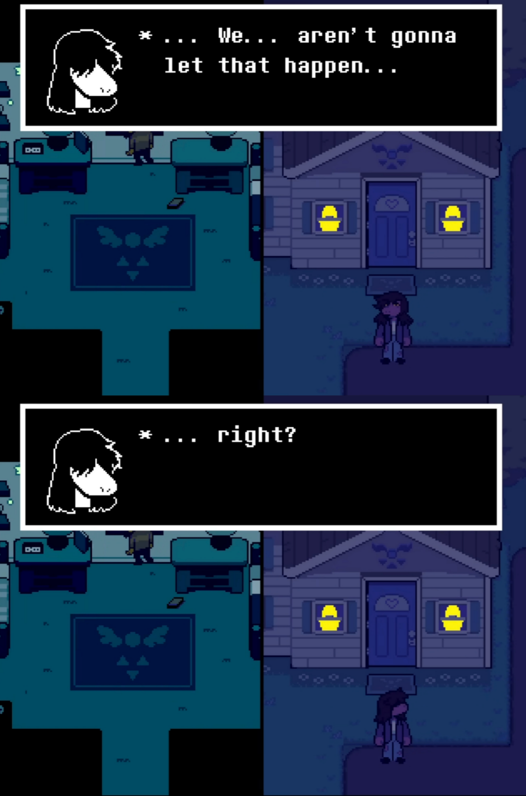
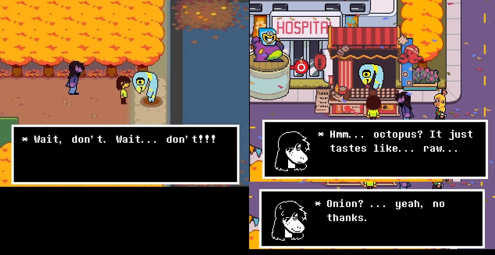
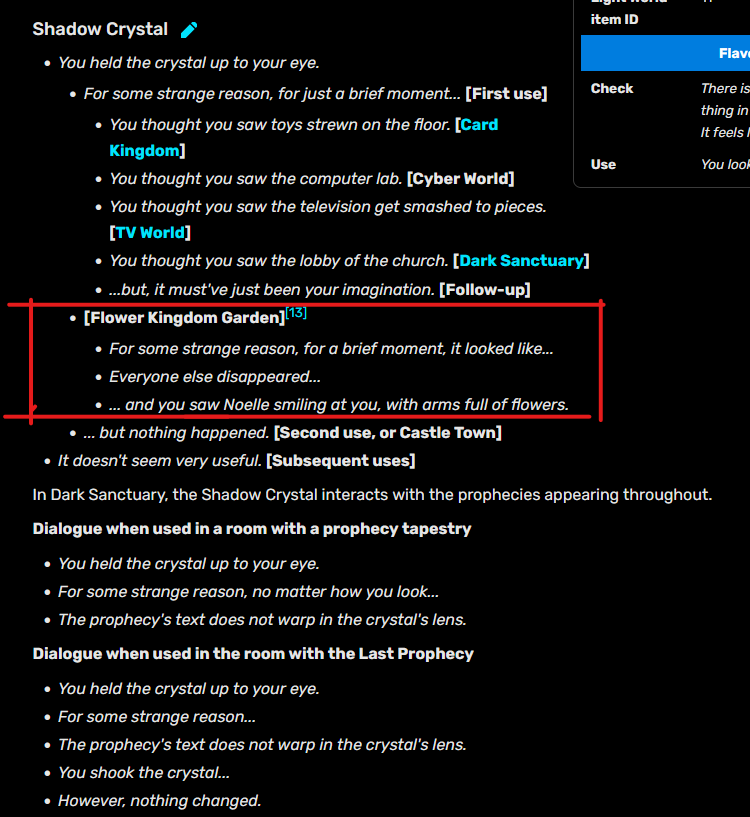
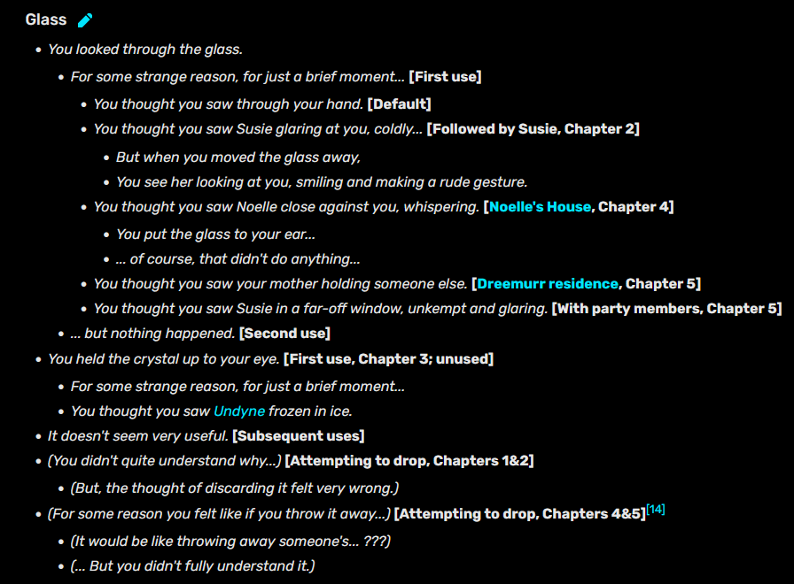
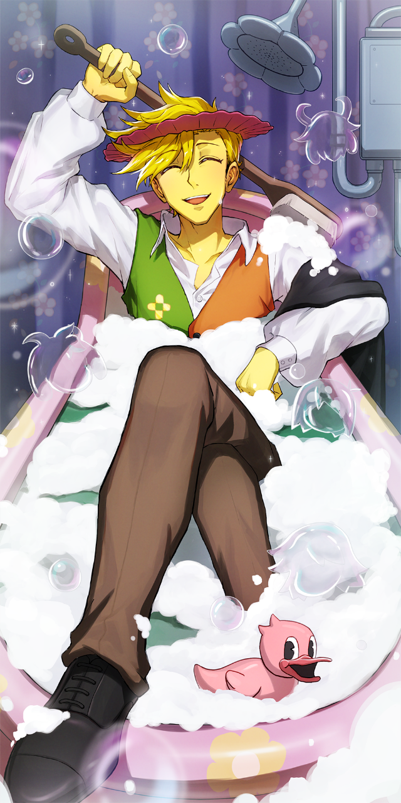
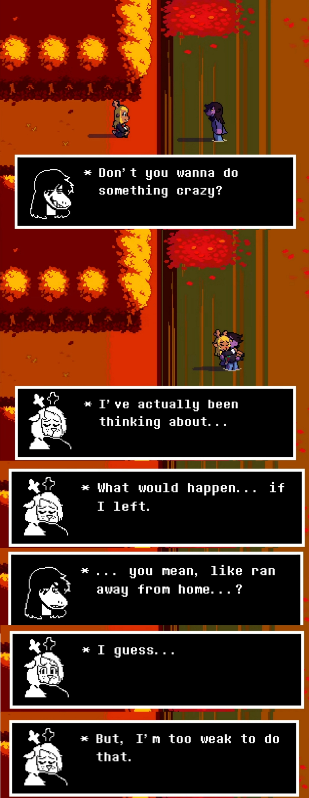

##Bentornato Sabaku!##

. **INTERROMPERE LA WEIRD ROUTE...?**  

Oggi abbiamo per te diverse cose, partiamo dal parlare della Weird Route e dal suo possibile abortirla:  

Se non lo hai scoperto da solo e se non te lo ha detto la chat, _sembra_ che non premere abbastanza velocemente "proceed" porti ad abortire la WR. E dico sembra, perché non si sente il solito motivetto che suona nei precedenti capitoli.  
Quindi gli eventi del capitolo 5 avverranno in maniera pressoché identica salvo i momenti subito dopo la scena del lago e qualche dialogo minore, dagli un'occhiata:  
<iframe width="560" height="315" src="https://www.youtube-nocookie.com/embed/On9rCiXX9LI?vq=hd1080p" title="YouTube video player" frameborder="0" allow="accelerometer; autoplay; clipboard-write; encrypted-media; gyroscope; picture-in-picture; web-share" referrerpolicy="strict-origin-when-cross-origin" allowfullscreen></iframe>  
‎

Cosa causerà ciò nel capitolo 6, nel quale Noelle sembra essere una parte importante? Non dovrà forse avere interazioni piuttosto diverse in base all'essere in Normal Route, Weird Route abortita nel Ch4 (Dove Berdly sarebbe ancora congelato) e abortita nel Ch5?  

. **PREOCCUPAZIONI PER IL FUTURO**

Parlando del diavolo, discutiamo brevemente delle paure per il capitolo 6 e del perché il 5 sia stato controverso. Quest'ultimo, nel bene e nel male, ha a tutti gli effetti messo "pausa" a buona parte degli eventi della trama principale.  
Il capitolo 4 si era chiuso in una maniera molto cupa con Susie che scopre nella profezia finale un futuro orribile e si promette di evitarlo che nel 5, salvo per una scena opzionale con Ralsei, non viene neanche menzionata e Susie sembra **veramente** non scossa dagli eventi e in generale è molto tranquilla rispetto a come sembrava alla fine del 4.  

Il capitolo in generale ha un tono estremamente leggero e divertente nonostante sembrasse proprio il finale del 4 il punto da cui tutto sarebbe diventato serio, e fa poco per rivelarci di più sui misteri che permeano la storia; molti hanno quindi paura di come potrebbe essere gestito il pacing dei capitoli in arrivo.   

Cosa è successo a Dess? Cosa è successo "On that day" che ha fatto perdere il lavoro ad Asgore (cosa che sapevamo da anni)? Chi è il Knight e cosa vuole per davvero? Chi era e cosa voleva il possessore del mantello nel Ch3? Cosa è Ralsei per davvero?  Cosa rivela la profezia finale di così tragico? Chi è e cosa vuole la voce dell'intro di gioco che chiama questo mondo "MY DELTARUNE", sarà davvero Gaster?

Personalmente penso che molti dei misteri siano chiaramente collegati fra loro e svelato uno gli altri diventeranno più facili da capire e spiegare quindi non sono molto preoccupato, ma allo stesso tempo non biasimo chi lo sia perché c'è sempre la possibilità che qualcosa non venga gestito appropriatamente.  

Ci sono anche altri dettagli poco apprezzati come ad esempio la magia di fuoco di Ralsei: essendo simile ai Dreemur che usano il fuoco, grazie al datamining e di alcuni ACT del Ch4, sono anni che si discuteva della possibilità che ci stesse tenendo nascosta questa magia e il Ch5 lo rivela in maniera abbastanza anticlimatica e in maniera poco signicativa...

Ma sono dettagli e opinioni della community alla fine, bisognerà vedere che farà Toby e il suo team che ha proprio affrontato le paure del pacing in una newsletter che leggerai come finale, e ha persino aggiunto un dialogo di lore molto intrigante con una patch e condizioni specifiche che ti mostreremo fra poco.
Se vuoi vedere quella che secondo me è una bella disanima critica del capitolo, consiglio questo video (non necessariamente da vedere adesso):   

<iframe width="560" height="315" src="https://www.youtube-nocookie.com/embed/iLg3LFkBxts?si=xOxGBr2Aakdgsnya" title="YouTube video player" frameborder="0" allow="accelerometer; autoplay; clipboard-write; encrypted-media; gyroscope; picture-in-picture; web-share" referrerpolicy="strict-origin-when-cross-origin" allowfullscreen></iframe>  

Ma ora basta con la malinconia e paura, let's have a last look at the fun things of these chapters:  
Questo capitolo è particolarmente pregno di chicche e dettagli, abbiamo deciso di concentrarci su quelle che potrebbero far partire discussioni, essere interessanti per avvenimenti futuri o quelle che avevi chiesto direttamente tu (tipo scelte alternative a certe scene) e quindi riducendo al minimo quelle comiche o secondarie, ma se vuoi ce ne potrebbero essere **molte altre** su cui ti potresti informare, o anche indizi a certe teorie succose che non menzioneremo.

. **MA CHE È SUCCESSO AD ONION-SAN??**

È dal capitolo 4 che è misteriosamente mancante e nello stesso capitolo Normal_NPC ci dice di non aspettarlo... il quale poi nel festival ci vende per 2G *(moneta di Undertale e non di Deltarune by the way)* usando le sue parole "palline fritte di **polpo**" e Susie noterà che hanno un sapore di "**Cipolla** cruda"... improvvisamente è Hannibal? Lo ha tolto di mezzo per ragioni relative alle scene del lago di entrambe le Route forse?

. **SCELTE ALTERNATIVE AL FESTIVAL**

Ecco a te dei video per vedere le varie scelte possibili al festival. Non sottovalutare queste scene perché alcune danno una *panoramica* abbastanza importante sul rapporto d'infanzia fra Kris e Noelle, partendo dalla votazione del Re e della Regina:  

<iframe width="560" height="315" src="https://www.youtube.com/embed/9hYpDNsGvr4?vq=hd1080p" title="YouTube video player" frameborder="0" allow="accelerometer; autoplay; clipboard-write; encrypted-media; gyroscope; picture-in-picture; web-share" referrerpolicy="strict-origin-when-cross-origin" allowfullscreen></iframe>

A seguire, le scelte per i giri sulla ruota panoramica. Normalmente Noelle si rifiuta di andare con Kris, ma se voti per loro 2 come Re e Regina, lei sarà nostalgica per la loro infanzia e quindi accetterà:

<iframe width="560" height="315" src="https://www.youtube-nocookie.com/embed/eH_P_-E6BY4?vq=hd1080p" title="YouTube video player" frameborder="0" allow="accelerometer; autoplay; clipboard-write; encrypted-media; gyroscope; picture-in-picture; web-share" referrerpolicy="strict-origin-when-cross-origin" allowfullscreen></iframe>

Finiamo con il Test di Forza per quanto riguarda i nostri 3 ragazzi:

<iframe width="560" height="315" src="https://www.youtube.com/embed/RCjkD0c_X0U?vq=hd1080p" title="YouTube video player" frameborder="0" allow="accelerometer; autoplay; clipboard-write; encrypted-media; gyroscope; picture-in-picture; web-share" referrerpolicy="strict-origin-when-cross-origin" allowfullscreen></iframe>

L'ultima scena con delle effettive scelte è quella di PizzaPants. Forse quella in cui gli mostri la verità è un foreshadowing di quello che avverrà quando Kris e la sua collaborazione col cavaliere verrà rivelata?

<iframe width="560" height="315" src="https://www.youtube-nocookie.com/embed/1utf9XZIv5E?vq=hd1080p" title="YouTube video player" frameborder="0" allow="accelerometer; autoplay; clipboard-write; encrypted-media; gyroscope; picture-in-picture; web-share" referrerpolicy="strict-origin-when-cross-origin" allowfullscreen></iframe>

. **I 3 MIKE E NAGASAGY KIKKY PARK**

Nelle Newsletter precedenti al capitolo, Toby ci aveva anticipato entrambe le scene dei 3 Mike del Ch5. Nella seconda appare addirittura Tenna [(Qui il link se la vuoi vedere)](https://www.reddit.com/r/Deltarune/comments/1pq5ls5/new_cutscene_from_ch_5/), avendo creato questa aspettativa dove quasi credevi che tornasse in Città nonostante tu lo dia a Mettaton, ma poi nel capitolo se lo hai effettivamente regalato non appare e Toby fa una battuta meta con Mike che dice "Ehi ma è un tizio importante, mica va via per sempre per davvero... giusto?".

In ogni caso, non hai notato un dettaglio sul muro in fondo alla stanza, il suo centro è mezzo glitchato come se ci fosse una porta nascosta male... siamo stati mesi a specularci dato che abbiamo avuto le scene con largo anticipo, alla fine la porta era reale o non era niente? A te la verità:

<iframe width="560" height="315" src="https://www.youtube-nocookie.com/embed/SeLCOQMLHXI?vq=hd1080p" title="YouTube video player" frameborder="0" allow="accelerometer; autoplay; clipboard-write; encrypted-media; gyroscope; picture-in-picture; web-share" referrerpolicy="strict-origin-when-cross-origin" allowfullscreen></iframe>  

. **ZENLOOKER**

Hai commesso il crimine IMPERDONABILE di aver quasi beccato un segreto ed averlo perso all'ultimo. Ecco a te:  

<iframe width="560" height="315" src="https://www.youtube-nocookie.com/embed/k_werpCHfEE?vq=hd1080p" title="YouTube video player" frameborder="0" allow="accelerometer; autoplay; clipboard-write; encrypted-media; gyroscope; picture-in-picture; web-share" referrerpolicy="strict-origin-when-cross-origin" allowfullscreen></iframe>  

. **SUNSET OF THE 7 SUNS**

Il nome di questa canzone è meno metaforico di quanto si potrebbe pensare. Infatti, se ci fai caso, nel corso dell'esplorazione delle Cliffs e del castello incontreremo proprio 7 soli di colori diversi corrispondenti ai fiori stessi, e come ci viene mostrato da quella in Castle East che si mangia il fungo, non sono altro che Volpi che emettono colori. [Forse sono le 7 lampade sopra ad ogni fiore nella stanza di Asgore?](https://www.reddit.com/r/Deltarune/comments/1uy2avp/asgore_ceiling_lights_are_the_seven_suns_in_the/)  

Nell'attacco finale di Omega Flowery potrai persino notare come ti attacca 7 volte, ognuna con un colore del sole diverso:  

<iframe width="560" height="315" src="https://www.youtube-nocookie.com/embed/v3aPJHMHN2Y?vq=hd1080p" title="YouTube video player" frameborder="0" allow="accelerometer; autoplay; clipboard-write; encrypted-media; gyroscope; picture-in-picture; web-share" referrerpolicy="strict-origin-when-cross-origin" allowfullscreen></iframe>  

. **SETH E LO STUDIO DELLE NOSTRE DEBOLEZZE**

Come ricorderai Seth ordinerà ad Aqua di usare l'attacco con il quale lei ci ha colpito di più nella sua prima fight. Se non dovessi aver preso danno durante di essa, [il gioco lo terrà in considerazione](https://www.reddit.com/r/Deltarune/comments/1uj25qo/chapter_5_special_attack_and_dialogue_for_beating/)

Parlando della battaglia, quando Aqua usa l'attacco papera che ti fa solo 1 danno... che succede nell'evenienza dove tu fossi ad 1 HP e ti colpisse...?  

<iframe width="560" height="315" src="https://www.youtube-nocookie.com/embed/lTCLzDZzFus?si=cD9sXZZJhk06lsvD&amp;start=35?vq=hd1080p" title="YouTube video player" frameborder="0" allow="accelerometer; autoplay; clipboard-write; encrypted-media; gyroscope; picture-in-picture; web-share" referrerpolicy="strict-origin-when-cross-origin" allowfullscreen></iframe>  

. **SCELTE ALL'ONSEN CON SUSIE**

Ecco a te le scelte alternative all'Onsen con Susie se volessi vederle:

<iframe width="560" height="315" src="https://www.youtube-nocookie.com/embed/p_nMxp3WB3o?vq=hd1080p" title="YouTube video player" frameborder="0" allow="accelerometer; autoplay; clipboard-write; encrypted-media; gyroscope; picture-in-picture; web-share" referrerpolicy="strict-origin-when-cross-origin" allowfullscreen></iframe>  

. **FINALE DI TANTE COSE**

Questo capitolo è stato la fine di tante cose... lo Shadow Cyrstal finale, l'Uovo finale, il capitolo leggero e avventuresco finale, ma anche...

<iframe width="560" height="315" src="https://www.youtube-nocookie.com/embed/SkLmyyg-h_I?si=BFOrCUihM1wyStM1&amp;start=201" title="YouTube video player" frameborder="0" allow="accelerometer; autoplay; clipboard-write; encrypted-media; gyroscope; picture-in-picture; web-share" referrerpolicy="strict-origin-when-cross-origin" allowfullscreen></iframe>

. **LYRICS DELLE CANZONI**

Se ti interessasse leggerle, [ecco a te le lyrics del tema di pink.](https://deltarune.wiki/w/Cutie_Mew_Mew_Magic)  e quelle di [Flowery](https://deltarune.wiki/w/Flower_Man)

. **A PROPOSITO DI GATTI, MA IL NOSTRO CARO VECCHIO AMICO?**

Parliamo di questa entità presente fin dal Capitolo 2. In questo capitolo ha solo fatto una singola apparizione estremamente nascosta ma che in un certo senso per la prima volta ci dà una sorta di interazione ufficiale, anche se non è stata molto amichevole...

<iframe width="560" height="315" src="https://www.youtube-nocookie.com/embed/t1FPpmWwVrA?vq=hd1080p" title="YouTube video player" frameborder="0" allow="accelerometer; autoplay; clipboard-write; encrypted-media; gyroscope; picture-in-picture; web-share" referrerpolicy="strict-origin-when-cross-origin" allowfullscreen></iframe>

Secondo la wiki, il danno che infligge in questo incontro dipende dal valore del primo oggetto nel nostro inventario, facendo danno equo al suo valore di vendita.  
Ehi ma ho letteralmente realizzato mentre scrivevo questo che tutti i primi 3 capitoli ci danno uno glowshard, i quali aumentano di valore ad ogni capitolo... forse noi hoarder ci stiamo portando dietro delle bombe ad orologieria...? Ci sono anche i DogDollar che invece diminuiscono di valore... può essere che questi item apparentemente troll possano essere utili?

Questo è tutto ciò che c'è in questo capitolo di questo personaggio. Ci aspettavamo sarebbe apparso per davvero, che fosse il boss segreto, ma nisba... Forse è davvero un easter egg insignificante su cui stiamo overthinkando che non apparirà mai davvero.

. **OR IS IT?**

In una patch successiva alla release dal gioco, qualche settimana dopo di essa, Toby ha aggiunto un dialogo molto particolare e segreto nello shop di Pink. Per ottenerlo hai bisogno di 3 prerequisiti, 2 di essi estremamente interessanti: Battere Pink, **aver ottenuto l'uovo del capitolo ed essere stato *danneggiato da Friend nell'interazione sopra citata.***

<iframe width="560" height="315" src="https://www.youtube-nocookie.com/embed/qS4QhxIONDk?vq=hd1080p" title="YouTube video player" frameborder="0" allow="accelerometer; autoplay; clipboard-write; encrypted-media; gyroscope; picture-in-picture; web-share" referrerpolicy="strict-origin-when-cross-origin" allowfullscreen></iframe>  

Queste Uova, apparentemente connesse a qualcosa di traumatico che Kris ha vissuto, piene di "proteine" da nascondere che tanto piacciono a questo gruppo di gatti comandati da qualcuno (Eram, il possessore del mantello?)... ma che diavolo significa tutto questo? Aggiungiamolo alla pila di misteri da risolvere negli ultimi capitoli.

Ricordo che come discusso precedentemente, le "Uova" sembrano proprio essere un problema, un "Issue" da parte della Voce dell'intro e dal codice di gioco stesso (Uno dei dettagli è infatti che non ottieni i trofei "COMPLETE CHAPTER X WITHOUT ISSUE" se hai l'Uovo).

. **PARLANDO DELLE UOVA**

Un'altra chicchetta dell'Uovo è che se lo possiedi potrai selezionarlo come prova durante il processo della bossfight di Blue e Yellow e il suo testo dice "It's evidence. You'll know what it was evidence for when it happens." Direi abbastanza minaccioso.   
Invece questo è il dialogo dell'Uomo se non le hai prese tutte, piuttosto intrigante ma sembra solo un hint per spiegarti che devi ottenerne altre:

<iframe width="560" height="315" src="https://www.youtube-nocookie.com/embed/2yHtmiFdAA4?vq=hd1080p" title="YouTube video player" frameborder="0" allow="accelerometer; autoplay; clipboard-write; encrypted-media; gyroscope; picture-in-picture; web-share" referrerpolicy="strict-origin-when-cross-origin" allowfullscreen></iframe>

. **DIALOGO SEGRETO DEL SHADOWCRYSTAL**

In questo capitolo per qualche motivo il cristallo non ti dà il solito dialogo di vedere il mondo dei lightner attraverso di esso, ma funziona in una stanza specifica con un dialogo particolare... lo includiamo insieme agli altri se li volessi rivisitare e quelli che ottieni usandolo nel Light World, essendocene uno nuovo.  

  

. **UN BAGNO TROPPO FREDDO PER FLOWERY**

Se abortisci la Weird Route in un qualunque momento successivo al congelamento di Berdly, la sua versione papera sarà assente dall'illustrazione BromideF  

. **LA FLOWERY SCARF**

Se modifichi il gioco in modo tale da poter equipaggiare la sciarpa di Flowery su Ralsei, scoprirai che è davvero l'oggetto più OP del gioco con +70 AT, +70 DF e +70 Magia. 
Ma dopo la sua morte si tramuta in una sciarpa inutile, la "Broken Scarf", mostrando che alla fine Flowery era tutto fumo e niente arrosto... eccetto che in realtà è un oggetto piuttosto forte, Ralsei la può indossare davvero e dando un boost ***nascosto*** alle stats di Ralsei pari a +12 AT, +3 DF e +3 Magia, rendendola davvero una buona opzione come arma definitiva per Ralsei. Forse saremo in grado di ripararla rendendola ancora più forte?

. **DIALOGO "SEGRETO" CON FLOWERY"**

A fine gioco, quando dici addio ai fiori, se fai una cosa abbastanza controintuitiva e provi a saltargli parlando con Flowery, questo ti darà un dialogo che pochi beccano e molto affascinante. Includiamo anche la scelta di non accompagnare Susie a casa in caso non l'abbia vista:

<iframe width="560" height="315" src="https://www.youtube-nocookie.com/embed/8-j_lACNG84?vq=hd1080p" title="YouTube video player" frameborder="0" allow="accelerometer; autoplay; clipboard-write; encrypted-media; gyroscope; picture-in-picture; web-share" referrerpolicy="strict-origin-when-cross-origin" allowfullscreen></iframe>  

. **LA PIANO COLLECTION**  

Questo capitolo ha usato per 2 volte (Stanza dell'Uovo e i Crediti) canzoni ufficiali arrangiate in pianoforte rilasciate mesi fa, se dovessero essere di tuo gusto puoi ascoltarle [qui](https://youtube.com/playlist?list=OLAK5uy_kz0dNb0tFbww-cJAyu1OHCw2_pRZ2P_eI&si=NA6Z-TU81Am47glg).

. **L'ARG DELLA WEIRD ROUTE** 

A partire da Maggio del 2025 Toby ha fatto teaser della Weird Route attraverso uno *strano* questionario. È abbastanza lungo da spiegare, quindi facendola breve lui ha posto per 2 volte la domanda "How long did it take for her to smile?" senza contesto alle quali gli utenti hanno provato a rispondere.   

In quello più recente poco prima della release del ch5 ha chiesto "Where did it happen?" e a quelli che hanno risposto "The Lake - The Shore - **Under the lake**" ha implicitato avessero indovinato mostrando uno screenshot di Kris al lago durante la Weird Route. Se vuoi più dettagli, alcune delle risposte interessanti che Toby ha dato, dai un'occhiata alla wiki qui: [https://deltarune.wiki/w/Thank_you_survey](https://deltarune.wiki/w/Thank_you_survey)

Dato che siamo in tema, ci sono diverse istanze di foreshadowing degli eventi della ch5weird route, eccone alcuni:  

<iframe width="560" height="315" src="https://www.youtube-nocookie.com/embed/6e9G87lotxA?start=303&amp;end=356?vq=hd720p" title="YouTube video player" frameborder="0" allow="accelerometer; autoplay; clipboard-write; encrypted-media; gyroscope; picture-in-picture; web-share" referrerpolicy="strict-origin-when-cross-origin" allowfullscreen></iframe>

<iframe width="560" height="315" src="https://www.youtube-nocookie.com/embed/S0P7YYbjYr4?si=js8nOY8iVl3cBcHU&amp;start=17?vq=hd1080p" title="YouTube video player" frameborder="0" allow="accelerometer; autoplay; clipboard-write; encrypted-media; gyroscope; picture-in-picture; web-share" referrerpolicy="strict-origin-when-cross-origin" allowfullscreen></iframe>

. **LA PAGINA WEB**

Ti ricordi quando ti abbiamo mostrato la pagina [https://deltarune.com/chapter5/](https://deltarune.com/chapter5/) che ci faceva foreshadowing della Weird Route? Ridagli un'occhiata, Toby ha aggiornato qualcosa...

. **LA NEWSLETTER**

Infine, chiudiamo questa pagina lasciandoti l'ultima newsletter rilasciata da Toby se desideri leggerla, contiene risposte alle preoccupazioni del pacing, un messaggio pieno d'amore, concept del ch5, le sue solite stronzate e altro (e ricorda che se lo desideri puoi ricevere tu stesso questi aggiornamenti iscrivendoti!). [https://toby.fangamer.com/newsletters/summer26/](https://toby.fangamer.com/newsletters/summer26/)
