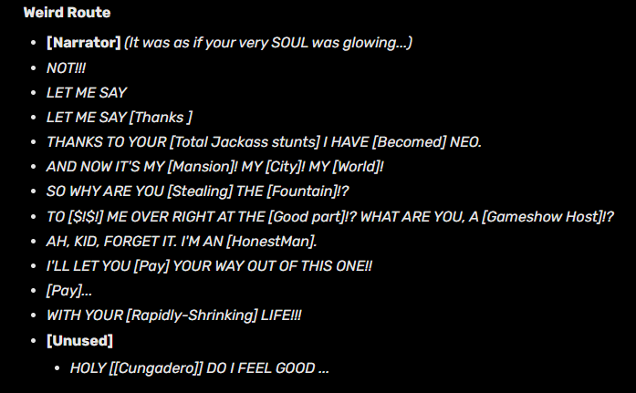
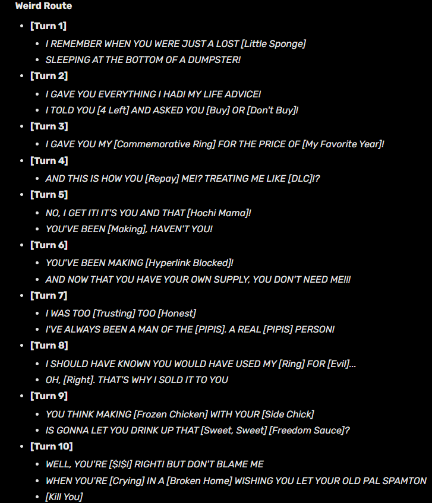
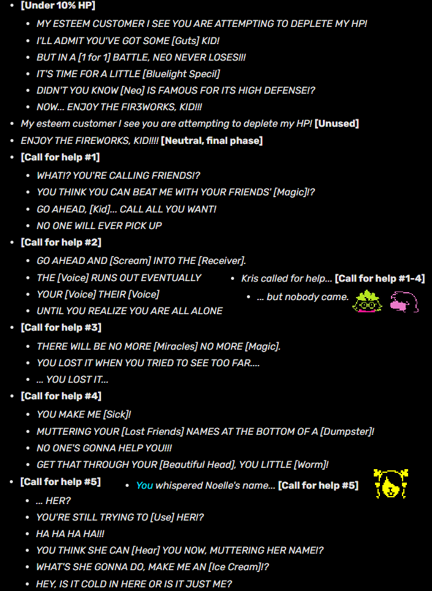

<h1>Weird Route</h1>

La weird route chiamata anche “Snowgrave” dai fan (“Weird Route” è comunque il nome a livello "ufficiale", siccome i file che si riferiscono a questi strani eventi sono definiti così), è una serie di eventi che è possibile intraprendere a partire da quando Noelle si unisce a Kris a metà del capitolo 2. È necessario congelare tutti i nemici attraverso l’incantesimo Iceshock di Noelle, facendo persino backtracking nell'area precedente (dove non avresti motivo di andare altrimenti). Ad ogni fine di battaglia apparirà il messaggio “Noelle became stronger.”, i suoi HP e quelli di Kris iniziano ad aumentare ed eventualmente lo farà anche il loro livello. 

**Nota: a prescindere da tutto questo, il livello nei Dark World sembra essere diverso dal LOVE di UT e il Light World (Dove infatti il LV di Kris rimane sempre 1). Sconfiggendo i nemici con la violenza appare il messaggio “You became stronger” e anche lì gli HP e il Livello aumentano, ma in questa route sembra il focus stia diventando Noelle. Inoltre, il livello nel Dark World aumenta automaticamente dopo gli eventi di entrambi i capitoli: nel capitolo 2 siamo di Livello 2, alla fine di esso saliamo a livello 3 dove rimarrà così per tutto il capitolo 3, e infine nel ch4 saremo di livello 4.**

Una volta che si è diventati abbastanza forti, bisognerà acquistare il FreezeRing da un Addison (uno dei vecchi amici di Spamton). Chiederà se Kris e Noelle stiano insieme, e si potrà rispondere “Siamo solo amici” o “Siamo qualcosa di più”; nel gioco base è una scelta innoqua, ma per continuare questa route diventa obbligatoria la seconda scelta. L’Addison ci offrirà quindi il FreezeRing, al modico prezzo di tutti i nostri soldi + 1. Essendo fisicamente impossibile acquistarlo, tormentiamo e costringiamo Noelle a **procedere** e congelarlo per prendere l’anello gratuitamente. Vorrei poter fare lo stesso con certi venditori online.

Scherzi a parte, questi eventi sembrano confusi per la povera ragazza. Lo schermo va a nero e sembra quasi non rendersi conto di quello che compie, come se fosse in una trance. Con l'Addison che scompare nel nulla e la descrizione dell anello ***"A ring with a snowglobe on it. ... is that someone inside?"***, è possibile concludere che l'Addison sia stato in qualche modo miniaturizzato all'interno di esso.

Nota interessante: ogni volta che si esegue con successo uno step per proseguire la route, suonerà in maniera ricorrente un certo suono abbastanza minaccioso. Allo stesso modo, è possibile "fallire" questi eventi. Se si avanza senza comprare l'anello, se si sconfigge anche un solo nemico senza congelarlo, o se si fanno certe scelte meno aggressive o altro, suonerà un jingle felice che indica l'uscita permanente dalla route, ecco entrambi i suoni:
<iframe width="560" height="315" src="https://www.youtube.com/embed/9tyGHbmlMOc" frameborder="0" allow="accelerometer; autoplay; encrypted-media; gyroscope; picture-in-picture" allowfullscreen></iframe>

Procedendo a congelare i nemici e forzando Noelle ad aggirare i puzzle per noi, congelandoli al posto di risolverli, incontreremo anche Spamton nascosto in un cassonetto della spazzatura. Anche lui ha un anello da offrirci, ma prima di farlo dobbiamo congelare tutti i nemici presenti nella mappa. In maniera reminescente alla genocide di UT, Spamton ci specificherà quanti nemici sono rimasti. Una volta congelati tutti, potremo acquistare il ThornRing al prezzo di D$1997.

A questo punto Noelle è diventata abbastanza forte da aver sbloccato un incantesimo fatale chiamato “Snowgrave”; il suo costo è di ben 200 TP, ma l’anello appena acquistato riduce della metà il costo degli incantesimi di ghiaccio, al costo di assorbire in battaglia gli HP di Noelle fino ad un massimo di 55 HP. Che sia una coincidenza o no, "55" in numeri romani si scrive "LV". Al contrario del FreezeRing che ha solo bisogno di essere ottenuto, per **procedere** è obbligatorio far indossare a Noelle il ThornRing, per renderere utilizzabile l'incantesimo Snowgrave contro l’unico ***nemico*** rimasto. Se ne hai voglia, guarda questa bellissima animazione di quel momento: 
<iframe width="560" height="315" src="https://www.youtube.com/embed/0XFurx0yrHI" frameborder="0" allow="accelerometer; autoplay; encrypted-media; gyroscope; picture-in-picture" allowfullscreen></iframe>

Da qui non si torna più indietro. Gli eventi cambiano in maniera permanente e irrevocabile. Spamton prende il controllo della magione di Queen, la magione stessa diventa perlopiù inaccessibile o comunque molto meno esplorabile del normale, Roulxs è completamente pietrificato e blocca l'accesso allo shop del palazzo. Si salta quasi subito alla conclusione del capitolo senza le solite normali esplorazioni e gag:

Noelle è talmente sconvolta dagli eventi che neanche Queen si sente a suo agio a tirarla in ballo come fa nella route normale, e non finiamo neanche per combatterla normalmente. Al posto dei normali eventi Queen salta immediatamente nel suo mech, ma stavolta Ralsei parla in anticipo del Ruggito, scioccando Queen e facendola smettere prima che inizi una battaglia. Il boss finale di questa route è invece Spamton NEO stesso, che è particolarmente frustrato perché proprio quando è riuscito a prendere il controllo, Kris si approccia a sigillare la fontana.

Verso la fine della battaglia, Spamton la mette in stallo usando la funzione più famosa del corpo NEO, la sua invincible difesa (proprio come Mettaton NEO nella geno di UT…?). Kris non può fare altro che chiamare aiuto, prova a chiamare Susie senza successo, prova a chiamare Ralsei senza successo, e infine noi sussurriamo il nome di Noelle e… in uno schermo nero sentiamo solo il suono familiare di IceShock, con dei numeri gialli a schermo che indicano danni altissimi. Nel silenzio e nel buio la fontana viene quindi sigillata.

Se vuoi rileggere i dialoghi durante la battaglia, eccoli qui:
Pre-battaglia:
 

Battaglia:

 
‎ 

Svegliati nel Light World, Noelle è sollevata di essersi finalmente svegliata da quell’incubo, in pieno contrasto alla route normale. Peccato solo che Berdly rimanga addormentato sul tavolo… analizzando il suo corpo, appare semplicemente il messaggio “He doesn’t seem to be awake.”. L’esplorazione di Hometown e gli eventi finali sono pressochè identici eccetto per la visita in ospedale. Nella sala principale vi è un giocattolo, di cui normalmente la descrizione recita ***"(It's one of those sliding bead toys that naturally spawns inside doctors' offices.)" "(The beads march grimly along their path.)"*** e nel ch2 continua: ***"(The beads march on)"*** ma dopo gli eventi della weird route il dialogo cambia in ***"(One of the blue beads is broken and torn off.)"***

L'ultima differenza è un dialogo molto impattante, consiglio vivamente di riguardare la scena intera:
<iframe width="560" height="315" src="https://www.youtube.com/embed/yryfLpycwy4?start=3207&amp;end=3468" frameborder="0" allow="accelerometer; autoplay; encrypted-media; gyroscope; picture-in-picture" allowfullscreen></iframe>

Piccola nota finale su quel dialogo: In questa route la preoccupazione principale e Kris, che è la prima persona che nota quando finisce di parlare col padre; al contrario nella route normale nota per prima Susie. Infine, nel dialogo con Kris ci sono diverse interazioni possibili, come ad esempio Noelle che nota Kris indossi il suo orologio (se lo equipaggi nel Dark World), ma persino muoverti durante il dialogo, cosa che la fa spaventare tantissimo.
<iframe width="560" height="315" src="https://www.youtube.com/embed/ZKagCHlTxTs?start=25&amp;end=40" frameborder="0" allow="accelerometer; autoplay; encrypted-media; gyroscope; picture-in-picture" allowfullscreen></iframe>

Questo è quanto per quanto riguarda la Weird Route. Ora, **procedi.**
