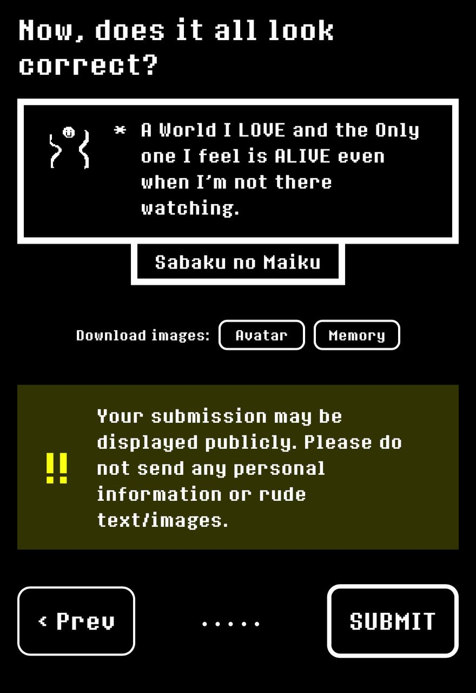
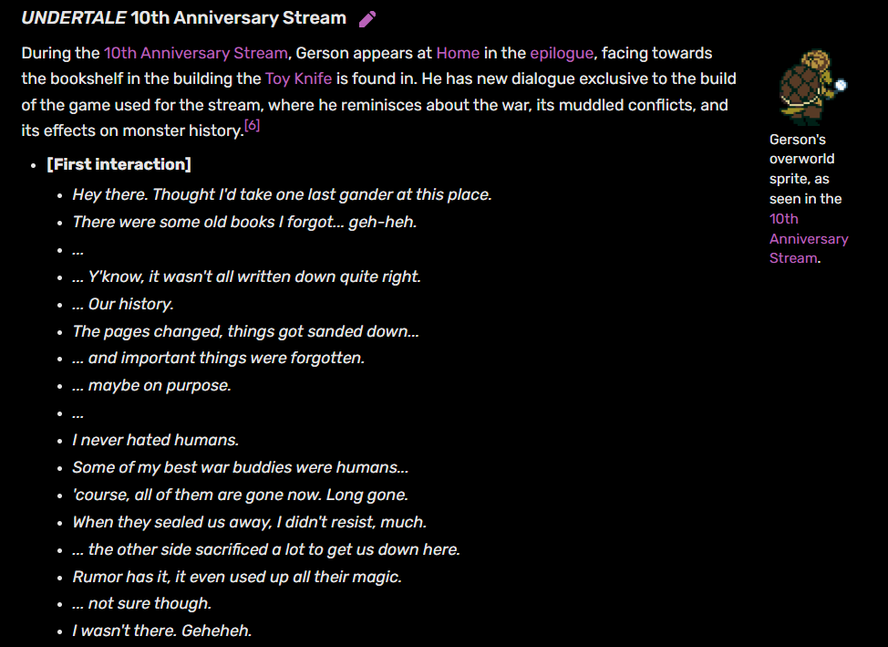
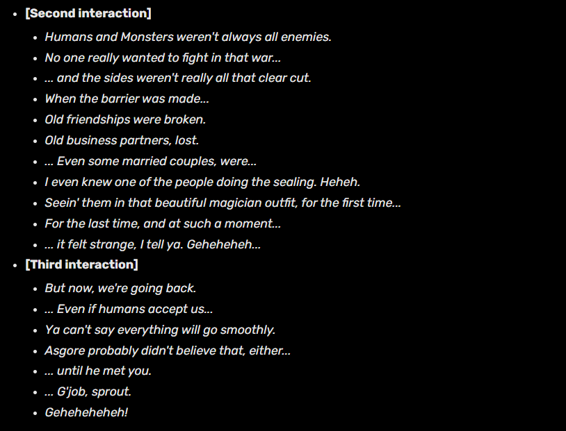

##PREMESSA##

Questa è una pagina composta da una grossa serie di trivia, chicche e segreti che Sabaku ha mancato nella sua run o per le quali semplicemente non è abbastanza terminally online da conoscere. Alcune sono più interessanti/importanti di altre, ma sarà comunque a tua discrezione scegliere su quali concentrarti. Detto ciò, iniziamo con le differenze della weird route del ch4 dopo la scena a casa di Noelle; come nel capitolo 3, sono poche e molte sono "opzionali" perché devi fare scelte di dialogo specifiche. In ogni caso sono parecchio più intriganti che nel 3 (video fatto da AbitDistant che parte già dal timestamp rilevante):

<iframe width="560" height="315" src="https://www.youtube-nocookie.com/embed/FbR-eSwNqiI?si=HHa0yjEQYIoJiu6H&amp;start=1744" title="YouTube video player" frameborder="0" allow="accelerometer; autoplay; clipboard-write; encrypted-media; gyroscope; picture-in-picture; web-share" referrerpolicy="strict-origin-when-cross-origin" allowfullscreen></iframe>

Ora, parliamo di chicche e segreti a partire dal...

##CAPITOLO 3##

. **IL DESIGN ORIGINALE DI TENNA**

Ti era già stato menzionato, ma lo ripetiamo con il link del post di Toby e i suoi vecchi disegni: Originariamente Tenna aveva un design da formica, che è stato successivamente cambiato. Dettaglio divertente che ovviamente non ha significato di lore (credo), ma il ["culo" delle formiche in inglese si chiama Gaster](https://nitter.net/tobyfox/status/1947855560122241361)

. **NOMI SEGRETI** 

 Tra reference a Earthbound/Mother e scioccare Tenna con parolacce per la gioa di Susie, ci sono vari possibili nomi che causeranno reazioni; hai già visto "ASS", ecco un video se vuoi vedere altri possibili esiti:
  <iframe width="560" height="315" src="https://www.youtube-nocookie.com/embed/qZh6yj0zY3w?si=TGBRHF6XZDpTuc8h" title="YouTube video player" frameborder="0" allow="accelerometer; autoplay; clipboard-write; encrypted-media; gyroscope; picture-in-picture; web-share" referrerpolicy="strict-origin-when-cross-origin" allowfullscreen></iframe>

. **SPAMTON LADRO DI LEITMOTIV**

Nel corso del capitolo 3 è possibile sentire ricorrentemente un certo tema che era già presente fin dal 2

<iframe width="560" height="315" src="https://www.youtube-nocookie.com/embed/ZaBHuyjC3ig?si=89ji55xmviTQ03GS" title="YouTube video player" frameborder="0" allow="accelerometer; autoplay; clipboard-write; encrypted-media; gyroscope; picture-in-picture; web-share" referrerpolicy="strict-origin-when-cross-origin" allowfullscreen></iframe>

. **IL TAGLIAERBA**

  Nella seconda board, vi è un'isola segreta che ti permette di fare punti extra
  <iframe width="560" height="315" src="https://www.youtube-nocookie.com/embed/Vg-4pqy9ZNw?si=v-wvbTPvmkkWRYGg" title="YouTube video player" frameborder="0" allow="accelerometer; autoplay; clipboard-write; encrypted-media; gyroscope; picture-in-picture; web-share" referrerpolicy="strict-origin-when-cross-origin" allowfullscreen></iframe>

. **LA GRANDE CORSA**

  È possibile vincere contro Susie nel giochino della Green Room (è più semplice di quanto ci si possa aspettare).
<iframe width="560" height="315" src="https://www.youtube-nocookie.com/embed/vjOM4N2PYQw?si=ZdWWIipeqLncvGDt&amp;start=38" title="YouTube video player" frameborder="0" allow="accelerometer; autoplay; clipboard-write; encrypted-media; gyroscope; picture-in-picture; web-share" referrerpolicy="strict-origin-when-cross-origin" allowfullscreen></iframe>

. **QUASI NON A CASO**

  La ball machine può regalare delle "fortune", alcune di queste vogliono essere degli indizi per l'uovo di questo capitolo:

|  |  |
|---------|-------|
| 
 

. **MANTLE**

Il titolo del gioco appare brevemente e in modo poco definito prima che scompaia, ma è comunque possibile vedere che originariamente il nome fosse in maniera molto probabile "Mantle".

|  |  |
|-----------|------------|
|   | |

. **ERAM**

Sempre parlando di altri indizi che rivelano dei dettagli, il probabile nome dell'entità che possiede il mantello è "ERAM"; molto probabilmente si tratta delle ultime quattro lettere di "nightmare" al contrario. Alcuni membri della community pensano che il nome sia questo, perché il titolo della OST di battaglia è, appunto, "ERAM". Ma sappiamo tutti che il vero nome si tratta invece di "John Mantle".

. **IL SENTIERO GHIACCIATO**

  Durante la board 2, è possibile provare a dirigersi verso i ghiacciai dell'Ice Palace. Se Tenna è presente, questo impedirà al party di proseguire, "censurerà" la scena e bloccherà l'accesso, come è capitato proprio a te. Ma se ci si va in sua assenza sarà invece possibile raggiungere quel luogo e il party commenterà la cosa.
<iframe width="560" height="315" src="https://www.youtube-nocookie.com/embed/wptBrUqnyIc?si=AUVrl4fMdYyFjbVB&amp;start=40" title="YouTube video player" frameborder="0" allow="accelerometer; autoplay; clipboard-write; encrypted-media; gyroscope; picture-in-picture; web-share" referrerpolicy="strict-origin-when-cross-origin" allowfullscreen></iframe>

. **SWORD ROUTE**

  Ci sono diverse stanze misteriose e vari segreti all'interno di questo gioco (cui eventi sono chiamati "Sword route" nei file). Li hai trovati quasi tutti, inclusi alcuni foreshadow del sopracitato ERAM, ma hai mancato due entrate segrete ai lati della piramide, che mostrano un caro vecchio amico:

<iframe width="560" height="315" src="https://www.youtube-nocookie.com/embed/MAfd02R8W-U?si=w-khFSIxpZf6o_nq&amp;start=316;end=368" title="YouTube video player" frameborder="0" allow="accelerometer; autoplay; clipboard-write; encrypted-media; gyroscope; picture-in-picture; web-share" referrerpolicy="strict-origin-when-cross-origin" allowfullscreen></iframe>

. **T-RANK ROOM - Z-RANK ROOM**

Completando le board con tanti punti e/o completando gli obiettivi extra si riceve il "T-rank"che dà accesso ad una stanza unica, che ha un diverso aspetto se ci entri dopo la Board 1 o dopo la 2. Se fai invece schifo ottieni lo Z-rank, che non ti permette di accedere a nessuna stanza, se non una segreta apposita per quel rango che permette comunque l'accesso al gioco di Ramb attraverso l'utilizzo del misterioso tombino che di solito è inutile. Avendo già ottenuto lo Z-Rank, ecco qui un video per le T-Rank di entrambe le board:

<iframe width="560" height="315" src="https://www.youtube-nocookie.com/embed/nxztwC-YK9w?si=ycGVDiHE8NHv5EZq" title="YouTube video player" frameborder="0" allow="accelerometer; autoplay; clipboard-write; encrypted-media; gyroscope; picture-in-picture; web-share" referrerpolicy="strict-origin-when-cross-origin" allowfullscreen></iframe>

. **IL SEGRETO DELLE RENNE**

All'interno di Mantle sono presenti il personaggio del White Cloak e la creatura oscura che segue i tuoi movimenti. Entrambi hanno uno sprite placeholder che gli rappresentano come renne, una normale e l'altra come "oscura". La variabile che nasconde [lo sprite delle renne si chiama  "toriel" nel codice](https://www.reddit.com/r/Deltarune/comments/1l64pkr/thoughts_on_this/).

Nota personale, ma credo che se qualcuno possa avere dubbi sull'identità del cavaliere, penso che quanto sopracitato sia una dimostrazione abbastanza evidente che si tratti di <del>un membro della famiglia Holiday</del> Papyrus che indossa corna finte, SCOMMETETE SEMPRE SU PAPYRUS CAVALIERE!!!

Altra nota, ma è curioso che questa creatura nera segua gli stessi movimenti di Kris che procede poi ad ucciderla in autonomia appena si avvicina...

. **ATTACCARE KRIS E SUSIE CON MINI-KRIS** 

Dopo aver ottenuto il mantello e dopo che Susie arriva a vedere che stesse facendo Kris, è possibile controllare il mini avatar e farlo entrare in scena. Se non ci si avvicina troppo ai 2, la scena continua come normale (E dettaglio importante, una volta che Susie scollega il controller, il Mini-Kris scompare), ma è possibile anche attaccare Kris e Susie e avere una scena alternativa segreta.

<iframe width="560" height="315" src="https://www.youtube-nocookie.com/embed/0o5fPiCmo4w?si=vfWAcmMFpQnz7DQ_" title="YouTube video player" frameborder="0" allow="accelerometer; autoplay; clipboard-write; encrypted-media; gyroscope; picture-in-picture; web-share" referrerpolicy="strict-origin-when-cross-origin" allowfullscreen></iframe>

. **IL RETRO DELLO SHOP DI RAMB**

Alla fine del capitolo, è possibile accedere al retro  del negozio e vedere Susie e Ralsei giocare.
<iframe width="560" height="315" src="https://www.youtube-nocookie.com/embed/L8zJZQrv8e8?si=NGp_IeUbs1ohSxUJ" title="YouTube video player" frameborder="0" allow="accelerometer; autoplay; clipboard-write; encrypted-media; gyroscope; picture-in-picture; web-share" referrerpolicy="strict-origin-when-cross-origin" allowfullscreen></iframe>

. **IL PASSATO DI RAMB**

Se salti anche un solo step del minigioco, Ramb si pietrificherà in anticipo impedendoti di completare Mantle, e un antipatico Pippins ci racconterà il suo passato.
<iframe width="560" height="315" src="https://www.youtube-nocookie.com/embed/9HF1VTpzPfc?si=q-a8FpLjpvR7NDEk" title="YouTube video player" frameborder="0" allow="accelerometer; autoplay; clipboard-write; encrypted-media; gyroscope; picture-in-picture; web-share" referrerpolicy="strict-origin-when-cross-origin" allowfullscreen></iframe>

. **CONGRATULAZIONI PER AVER BATTUTO IL CAVALIERE!!!!**

Col cavolo, il tuo traguardo non conta nulla. Il cavaliere è stato nerfato nella patch 1.03; i suoi attacchi dei tunnel di spade avevano delle hitbox gigantesche. Il tunnel in sé era estremamente stretto, e la parte finale con le linee rosse avevano hitbox molto più grandi delle linee stesse con addirittura situazioni dove era impossibile non subire danni. Da uno che l'ha battuto hitless, quell'attacco era veramente disonesto, e personalmente lo trovo al pari (se non peggio) del vecchio triplo slash del boss finale di Shadow of the Erdtree.

Mi dispiace ma non hai battuto il vero Knight, non sei un vero gamer.

 **LEALE FINO A UN CERTO PUNTO**

Già sai come Kris sia il membro del party che fa meno danno al Cavaliere facendogli persino meno male di quanto ne faccia Ralsei (che solitamente e in base al tuo setup è quello che ne fa di meno). Ma devi sapere che sotto certe condizioni, Kris può fare molto più male al suo alleato; per ogni party member a cui si azzerano gli HP, Kris farà il doppio dei danni, per un totale di danni TRIPLI se tutti e 2 i suoi amici sono a terra:

<iframe width="560" height="315" src="https://www.youtube-nocookie.com/embed/LrAw_cIh7LI?si=FX_3QszLSoCZTHL2&amp;start=14" title="YouTube video player" frameborder="0" allow="accelerometer; autoplay; clipboard-write; encrypted-media; gyroscope; picture-in-picture; web-share" referrerpolicy="strict-origin-when-cross-origin" allowfullscreen></iframe>

Francamente, ciò ci dice PARECCHIO su quali siano le sue vere emozioni e sentimenti, per quanto questo personaggio cerchi di nasconderli da noi giocatori...

Altro trivia sui danni, più la battaglia va avanti, più danno i party member faranno male al Knight (difatti nel video sopra linkato, Kris parte facendo circa 60 danni ma più avanti arriva a farne 116), un po' come se il riuscire a sopravvivere contro questo nemico gli riempisse di Speranza che reinforza i loro attacchi.

. **NO HIT?**

Allo stesso tempo, se lo si sconfigge senza essere colpiti, apparirà un messaggio speciale a fine battaglia che fa riferimento al suo doppiogioco.
<iframe width="560" height="315" src="https://www.youtube.com/embed/KOu-Zaw-uhc?si=2cKiS-RCREWGAM-Y&amp;start=257" title="YouTube video player" frameborder="0" allow="accelerometer; autoplay; clipboard-write; encrypted-media; gyroscope; picture-in-picture; web-share" referrerpolicy="strict-origin-when-cross-origin" allowfullscreen></iframe>

. **CANZONI PRONTE DA ANNI**

Alcune canzoni, secondo varie fonti come i metadata dei file o Toby stesso, erano già pronte e composte da anni già a partire dal 2018 nel caso del tema di battaglia del cavaliere, oppure "TV WORLD" che era già pronta nel 2016, da quanto detto da Toby nella newsletter dell'estate 2023.

[Post reddit](https://www.reddit.com/r/Deltarune/comments/1lirl5i/fun_fact_the_knights_battle_theme_was_rendered_in/)

[Newsletter](https://tinyurl.com/2u32erch)

Quella del Knight è particolarmente curiosa, perché infatti il leitmotiv della canzone era presente in OST del Capitolo 1

"The chase", rilasciata nel 2018 insieme al capitolo 1
<iframe width="560" height="315" src="https://www.youtube-nocookie.com/embed/hWWVWfQW1H4?si=pDH12jojCOfXG0D7&amp;start=10" title="YouTube video player" frameborder="0" allow="accelerometer; autoplay; clipboard-write; encrypted-media; gyroscope; picture-in-picture; web-share" referrerpolicy="strict-origin-when-cross-origin" allowfullscreen></iframe>

"The door", stessa cosa
<iframe width="560" height="315" src="https://www.youtube-nocookie.com/embed/KWi1-9eLO_o?si=11JPasCX7Cv0Lp6Q&amp;start=13" title="YouTube video player" frameborder="0" allow="accelerometer; autoplay; clipboard-write; encrypted-media; gyroscope; picture-in-picture; web-share" referrerpolicy="strict-origin-when-cross-origin" allowfullscreen></iframe>

Inoltre c'è "Nightmare Knight", canzone creata nel 2014 per il webcomic "Cucumber Quest" e che ha un leitmotiv abbastanza simile e che potrebbe essere stato usato come base. Prima del ch3, parecchi prodotti fanmade hanno usato proprio questa come possibile tema del Cavaliere:

<iframe width="560" height="315" src="https://www.youtube-nocookie.com/embed/t43ZIrsfof0?si=B8EH0iJfHJrCXlhD&amp;start=47" title="YouTube video player" frameborder="0" allow="accelerometer; autoplay; clipboard-write; encrypted-media; gyroscope; picture-in-picture; web-share" referrerpolicy="strict-origin-when-cross-origin" allowfullscreen></iframe>

##CAPITOLO 4##

. **BERDLY PERDE IL BRACCIO**

Nel capitolo 2, se si sconfigge Queen con la violenza (ma anche pacificamente, se in entrambe le precedenti battaglie contro Berdly nel capitolo lo si sconfigge con il fight), Berdly si rimuoverà la presa dalla faccia causando un'esplosione che gli brucerà il braccio, che nel Light World si traduce nella sua inabilità di muoverlo. Quindi nel capitolo 4 la libreria sarà inaccessibile e troveremo il nostro pennuto preferito in ospedale (più in salute che nella weird route), con un dialogo particolarmente iconico che è esattamente quello che ci aspetteremmo da Berdly.

Scena del ch2 

<iframe width="560" height="315" src="https://www.youtube-nocookie.com/embed/tm84YLxwwSk?si=6ZdqD84ZRtBQphxx&amp;start=62" title="YouTube video player" frameborder="0" allow="accelerometer; autoplay; clipboard-write; encrypted-media; gyroscope; picture-in-picture; web-share" referrerpolicy="strict-origin-when-cross-origin" allowfullscreen></iframe>

Scena del ch4 
<iframe width="560" height="315" src="https://www.youtube-nocookie.com/embed/nISrILfm1hs?si=API7GRrZh87l8_lx&amp;start=201" title="YouTube video player" frameborder="0" allow="accelerometer; autoplay; clipboard-write; encrypted-media; gyroscope; picture-in-picture; web-share" referrerpolicy="strict-origin-when-cross-origin" allowfullscreen></iframe>

. **DIALOGO ALTERNATIVO DI BERDLY**

Quando hai ascoltato il monologo di Berdly al telefono a casa di Noelle, hai risposto "Go with Berdly". Ecco la risposta alternativa "Sing the wrong number song"; come praticamente tutte le frasi di Berdly, quello che dice ha dell'incredibile:

<iframe width="560" height="315" src="https://www.youtube-nocookie.com/embed/nISrILfm1hs?si=kJ0twRtys6ZtKPEa" title="YouTube video player" frameborder="0" allow="accelerometer; autoplay; clipboard-write; encrypted-media; gyroscope; picture-in-picture; web-share" referrerpolicy="strict-origin-when-cross-origin" allowfullscreen></iframe>

. **LA "WRONG NUMBER SONG"**

A proposito della chiamata con Berdly, l'opzione di "cantare la canzone del numero sbagliato" è un riferimento ad un possibile evento randomico in Undertale dettato dal FUN Value che è capitato proprio a Mike nella genocide insieme a Cydo (e tra l'altro è meno raro di quanto Sabaku fosse stato portato a credere all'epoca, è letteralmente il più comune di tutti i FUN event con una percentuale del 38%). Se questo non è destino...

<iframe width="560" height="315" src="https://www.youtube-nocookie.com/embed/hqIYIEoWBVk?si=rvazD7YeOkh3ZaVq&amp;start=7924" title="YouTube video player" frameborder="0" allow="accelerometer; autoplay; clipboard-write; encrypted-media; gyroscope; picture-in-picture; web-share" referrerpolicy="strict-origin-when-cross-origin" allowfullscreen></iframe>

. **LA CAMERA DA LETTO DI CAROL E RUDY**

Lo sprite della stanza è parzialmente oscurato, anche usando tool esterni. E' comunque possibile notare un paio di cose interessanti: una seconda katana, oltre a quella che c'è in cucina, e una strana board con linee e foglietti che sembrerebbe indicare un qualche tipo di ricerca ossessiva o teoria del complotto da parte di Carol (da confrontare con la lavagna del complotto dei tre "Mike"). Va inoltre osservato come sembrerebbe che anche Asgore abbia una board molto simile, investigando il retro del suo negozio, e che parlando della board di Mike, venga detto che a Kris "non piaccia vedere cose come questa"
<iframe width="560" height="315" src="https://www.youtube-nocookie.com/embed/CGvVT2mQK6Y?si=pHK-FApZXu48P_IB&amp;start=36" title="YouTube video player" frameborder="0" allow="accelerometer; autoplay; clipboard-write; encrypted-media; gyroscope; picture-in-picture; web-share" referrerpolicy="strict-origin-when-cross-origin" allowfullscreen></iframe>

. **YOUR NOT TAKING TOO LONG**

Qual è il tempo limite che hai prima che la zucca rossa di Jackenstein faccia la sua terrificante apparizione? La risposta è... infinito. Eh già, in realtà non sono su un timer, ma si attivano una volta che ottieni la chiave e raggiungi certi punti specifici della mappa.

. **TUTTI I PEZZI DELL'ORGANO AZZURRO**

All'organo che Kris suona in quella scena memorabile, è possibile suonare alcuni pezzi "familiari"
<iframe width="560" height="315" src="https://www.youtube-nocookie.com/embed/aEm9WX-jNUA?si=kBiS4FwDnjeyjuZs" title="YouTube video player" frameborder="0" allow="accelerometer; autoplay; clipboard-write; encrypted-media; gyroscope; picture-in-picture; web-share" referrerpolicy="strict-origin-when-cross-origin" allowfullscreen></iframe>

. **IL CAVALIERE SMASCHERATO**

In un momento del capitolo 4, è possibile forzare Kris a pensare al cavaliere, immaginando un momento dove si toglie l'elmo:
<iframe width="560" height="315" src="https://www.youtube.com/embed/ncGNdt92hIM?si=9Ane3ieERJhGssXs&amp;start=44" title="YouTube video player" frameborder="0" allow="accelerometer; autoplay; clipboard-write; encrypted-media; gyroscope; picture-in-picture; web-share" referrerpolicy="strict-origin-when-cross-origin" allowfullscreen></iframe>

E tra l'altro, in queste scene nello specifico, quando Kris chiude gli occhi puoi notare Ralsei che corre via all'ultimo, per assicurarsi che non ci sia la Profezia Finale nel percorso.

. **DIALOGHI "SEGRETI" DI GERSON**

Nella battaglia contro Hammer Of Justice, il progresso è dettato dalle azioni che intraprendi; ogni volta che appaiono "le stelline" quando attacchi o ti curi con OkHeal, è un segno che la fight sta progredendo. Siccome difendersi non dà punti, è possibile "estendere" la battaglia ed ottenere dei dialoghi segreti che citano 1 ad 1 alcuni suoi dialoghi nella genocide di Undertale, e affrontare degli attacchi extra particolarmente difficili. A partire da questi attacchi, comincia a darti automaticamente punti per portare ad una conclusione la battaglia:

Dialoghi e attacchi segreti

<iframe width="560" height="315" src="https://www.youtube-nocookie.com/embed/tHGOMcujK4E?si=vxCGfWdPWXonw7wq&amp;start=192" title="YouTube video player" frameborder="0" allow="accelerometer; autoplay; clipboard-write; encrypted-media; gyroscope; picture-in-picture; web-share" referrerpolicy="strict-origin-when-cross-origin" allowfullscreen></iframe>

Dialoghi in Undertale - Genocide [quelli evidenziati]

. **LE DONAZIONI DELLA FONTANA**

Ci sono varie soglie per i premi delle donazioni alla fontana nel Primo Santuario, quella più alta fa riferimento ad un certo avido ragno di Undertale...
<iframe width="560" height="315" src="https://www.youtube-nocookie.com/embed/VSuLUMZ3D7E?si=9L0nEAvkteJpJkeI" title="YouTube video player" frameborder="0" allow="accelerometer; autoplay; clipboard-write; encrypted-media; gyroscope; picture-in-picture; web-share" referrerpolicy="strict-origin-when-cross-origin" allowfullscreen></iframe>

Inoltre, per ogni Uovo trovato, sarà aggiunto un Dark dollar alla donazione totale

. **CHICCA MUSICALE**

Avevi notato nel Second Sanctuary di Susie, come anche la musica fosse "rotta". Andiamo più nel dettaglio e spieghiamo il perché c'è questa sensazione (cedendo la parola ad Alex perché non capisco niente di teoria musicale): Toby fa una cosa molto rara e particolare, cambia ripetutamente il "tempo" (ovvero come viene misurata e suddivisa temporalmente una composizione) creando una ost che dà la sensazione di qualcosa di non ben definito e che musicalmente rappresenta perfettamente ciò che è il mondo oscuro di Susie. Ecco un video per rendere più chiaro cosa succede, in particolare nel Third Sanctuary:
<iframe width="560" height="315" src="https://www.youtube-nocookie.com/embed/hGLrgQ_UuHg?si=Nb5VmTpo4n3cwwkf&amp;start=166" title="YouTube video player" frameborder="0" allow="accelerometer; autoplay; clipboard-write; encrypted-media; gyroscope; picture-in-picture; web-share" referrerpolicy="strict-origin-when-cross-origin" allowfullscreen></iframe>

. **FRIEND INSIDE CHAPTER 4**

Nel capitolo 4, il nostro caro AMICO con occhi rosa e dorati, fa una singola apparizione segreta estremamente facile da mancare:
<iframe width="560" height="315" src="https://www.youtube-nocookie.com/embed/ZBQowWynD28?si=2mZdOSnvg7xvUEqf&amp;start=127" title="YouTube video player" frameborder="0" allow="accelerometer; autoplay; clipboard-write; encrypted-media; gyroscope; picture-in-picture; web-share" referrerpolicy="strict-origin-when-cross-origin" allowfullscreen></iframe>

. **GOOD, KEEP SMILING**

A proposito di sorrisi, ecco qui la reazione di Ralsei a questa crudelissima risposta:

<iframe width="560" height="315" src="https://www.youtube-nocookie.com/embed/Fio7UmbpQfQ?si=imLNhm8z_5HtJ92i&amp;start=472" title="YouTube video player" frameborder="0" allow="accelerometer; autoplay; clipboard-write; encrypted-media; gyroscope; picture-in-picture; web-share" referrerpolicy="strict-origin-when-cross-origin" allowfullscreen></iframe>

Trovo curioso come precedentemente nel capitolo, sia possibile dirgli che "Un darkner non dovrebbe sentire queste emozioni", ma Kris si tappa fisicamente la bocca per evitare di pronunciare quelle parole. Perché anche nel momento "Good, keep smiling." non lo protegge da quelle parole? Forse è troppo stanco da tutti gli eventi per reagire? 

<iframe width="560" height="315" src="https://www.youtube-nocookie.com/embed/20vmTiNm8fQ?si=ZU7SsNkqxZaU4pPR&amp;start=72" title="YouTube video player" frameborder="0" allow="accelerometer; autoplay; clipboard-write; encrypted-media; gyroscope; picture-in-picture; web-share" referrerpolicy="strict-origin-when-cross-origin" allowfullscreen></iframe>

. **DIALOGHI ALTERNATIVI A FINE CAPITOLO**

Su PlayStation, completare i capitoli senza ottenere neanche un trofeo porterà ad avere un discorso alternativo a fine capitolo. Questo è qualcosa di particolarmente difficile da fare, perché un po' come quelli di Undertale, sono trofei "scemi" per dare il contentino a Sony che obbliga a mettere i trofei per giochi non-demo. Alcuni esempi di trofei (da evitare): equipaggiare un'armatura/arma, non superare un tot di danni, abbracciare Ralsei etc... Questo è il dialogo che ottieni:

<iframe width="560" height="315" src="https://www.youtube-nocookie.com/embed/Z6bQHKYsZas?si=ypQGWtEqPD4Bzcto&amp;start=97" title="YouTube video player" frameborder="0" allow="accelerometer; autoplay; clipboard-write; encrypted-media; gyroscope; picture-in-picture; web-share" referrerpolicy="strict-origin-when-cross-origin" allowfullscreen></iframe>

##SUPER TRIVIA E TEORIE##

. **THE TAIL OF HELL**

Parliamo della "Coda dell'inferno" e diamo subito una POSSIBILE risposta riguardo a cosa si possa trattare: la community ha concluso che si possa trattare della coda del nostro rinomato felino FRIEND, che con essa ha attirato "i bambini nel luogo dove la foresta crescerrebbe/crescerà": "Lost where the forest would grow, the children followed the pointed tail".

Si è raggiunti a questa conclusione, perché in uno dei blog di Noelle degli Spamton Sweepstakes, la ragazza parla di come tutti i gatti del gioco su cui ha passato tanto tempo a sperimentare e cercare glitch, "Cat petterz" siano composti da "cerchi", similmente a come la coda è rappresentata nel pannello della Profezia; si teorizza che FRIEND si sia "schiuso" da un uovo nato da un glitch causato proprio da Noelle. Link ai blog in questione, non sono necessari da leggere in live, ma li lasciamo per completezza:

[https://deltarune.com/catpetterz/](https://deltarune.com/catpetterz/)

[https://deltarune.com/egg/](https://deltarune.com/egg/)

[https://deltarune.com/bluecircle/](https://deltarune.com/bluecircle/)

Sia chiaro che come già detto precedentemente, questi link e dettagli non sono ufficialmente canonici ed è abbastanza certo che non siano necessari per una piena comprensione dei futuri capitoli, ma questi indizi sono comunque stati piazzati per un motivo e non sono a caso.

Fanart della tail of hell e friend, un possibile concept della forma completa del felino:

  
|  |  |
|---------|-------|
AUTORE: {.p} [@C8KIES](https://nitter.net/C80KIES/status/1963409420328784380) | |

 [Un possibile test di animazione in beta per la coda](https://www.reddit.com/r/Deltarune/comments/1omvcqz/chapter_3_unused_room_room_perspective_testing/)

 

. **CANZONI VECCHIE DI UN DECENNIO**

Nel lontano Aprile 2012, Toby posta, a detta sua "Made up yume nikkis" che nella sua lingua forse si traduce in "canzoni fanmade per Yume Nikki", un vecchio videogioco che è stata una sua grossa ispirazione.  In questo post è possibile sentire 2 tracce molto familiari, 2 versioni del tema delle stanze delle uova (Si presume del Forgotten Man stesso), intitolate "The waltz of Seccom Masada", un personaggio monocromatico e misterioso di Yume Nikki. La versione 8-bit è perfino stata riutilizzata 1 ad 1 senza alcuna modifica per la stanza dell'uovo del Ch3

[Post tumblr](https://www.tumblr.com/fwugradiation/20325508850/made-up-yume-nikkis-dark-tunnel-amphitheater) (Le canzoni in questione sono poco dopo la metà dello strano player di tumblr senza timestamp)

[Seccom Masada. Familiare?](https://tinyurl.com/4k8fj57e)

. **POSSIBILI TITOLI DI CANZONI FUTURE**

Il nemico Bibliox del ch4, quello che ti fa fare lo spelling corretto di certe parole come suo ACT, ha come particolare di avere 5 parole nella sua pool di termini selezionabili che sono i titoli di alcune delle ost di gioco. Questo ha portato a pensare che le altre parole possano essere i titoli proprio di canzoni che ancora non conosciamo; 

ma in realtà una di esse, AMPHITHEATER è proprio presente in quello stesso post tumblr vecchio di 13 anni menzionato precedentemente. È possibile che siamo in grado di ascoltare proprio adesso una canzone futura non ancora rilasciata in maniera ufficiale, o almeno una sua vecchia versione. 

[Qui](https://www.reddit.com/r/Deltarune/comments/1mglezs/an_old_tumblr_post_already_contains_a_future/) un post reddit più dettagliato.

. **NOELLE HA VISSUTO IL LABIRINTO A CROCE DI MANTLE**

In uno dei "Blog di Noelle" rilasciati precedentemente ai capitoli 3 e 4 nei quali parla dei glitch e misteri che cerca (e trova) nei videogiochi, la ragazza racconta della sua esperienza con un familiare labirinto a croce che necessita di un certo personaggio per essere superato. Il titolo di questo blog presenta anche il misspelling di "Glacier" come "Glaceir". Quest'ultimo è proprio il titolo del tema di quest'area nel capitolo, e questo typo è probabilmente un riferimento al videogioco Brandish 3 che presenta il medesimo mispelling.

Lo ripetiamo ancora una volta, questi blog non sono canonici e al 99% non saranno MAI necessari per capire eventi futuri, ma l'idea che MANTLE sia una versione modificata di Dragon Blazers a cui Noelle ha giocato, è parecchio interessante:

[https://deltarune.com/icepalace_glaceir/](https://deltarune.com/icepalace_glaceir/)

. **L'ANGELO E LA PROFEZIA**

Mi permetto una nota e ipotesi più personale: la profezia in Deltarune secondo me diventerà molto simile a quella di Undertale. In questo, Gerson ci racconta della profezia (huh, in entrambi i giochi ci parla di profezie nebbiose e interpretabili...), di come "l'Angelo arriverà a liberare i mostri dall'Underground". L'interpretazione è abbastanza ovvia e normale, e infatti si avvera nella True Pacifist dove l'Angelo si rivela Asriel e libera i mostri distruggendo la Barriera.

Ma nello stesso dialogo, Gerson ci racconta come la gente ha iniziato ad avere una interpretazione più macabra, interpretando la "liberazione" come "morte"; questo infatti si avvera nella Genocide ove invece siamo noi l'Angelo, ma della distruzione (Perché Chara ci ha costretti a fare tutto questo??).

E se questa cosa si invertisse nella weird route? Noi siamo l'Angelo nella route normale, noi porteremo felicità e speranza e con il nostro potere di scacciare via l'oscurità aiutiamo gli eroi. Mentre Noelle diventa l'angelo della distruzione nella weird route, la quale è tutta una preparazione per la sua "ascesa". Allo stesso tempo però, in questa situazione Noelle sarebbe uno strumento sotto il nostro controllo... Beh, è solo una speculazione. Allego uno screenshot nascosto di una vecchia newsletter che fa un'altra allusione a lei come Angelo:

. **GLI ALTRI MESSAGGI NASCOSTI NEL CODICE**

Nel recap, ti avevamo mostrato dei messaggi segreti presenti nel codice di entrambi i capitoli che mostravano il dialogo di una persona dispersa chissadove e che occassionalmente sentiva un suono simile a dello "scratching". Questi messaggi sono apparsi anche nel codice dei capitoli 3 e 4 e trovati dalla community:

[Code del capitolo 3](https://preview.redd.it/additional-unused-text-strings-found-in-the-games-code-v0-ekalrxzg415f1.png?width=640&crop=smart&auto=webp&s=04e957cd7f08132096ca808c837e7ce25049cb8d)
[Code del capitolo 4](https://preview.redd.it/additional-unused-text-strings-found-in-the-games-code-v0-liid9szg415f1.png?width=640&crop=smart&auto=webp&s=13fba1207ac5ca2b969f7ebdd3711e4efa4110c3)

. **POSSIBILE GROSSO INDIZIO SUL FUTURO DELLA WEIRD ROUTE**

Precedentemente all'uscita dei nuovi capitoli, sono stati scoperti i seguenti link del sito di Deltarune:

[https://deltarune.com/chapter1](https://deltarune.com/chapter1) porta ad una pagina con la scritta "Not applicable."

[https://deltarune.com/chapter2](https://deltarune.com/chapter2) porta ad una pagina con la scritta "Applicable."

[https://deltarune.com/chapter3](https://deltarune.com/chapter3) porta ad una pagina con la scritta "Not applicable."

Questo molto probabilmente si riferisce appunto alla Weird Route, la quale nel Capitolo 2 è effettivamente "Applicabile" e nel 3 è praticamente inesistente. Ma facendo lo stesso col capitolo 4...

[https://deltarune.com/chapter4](https://deltarune.com/chapter4) appare solo uno schermo nero nel quale lentamente si forma un singolo pixel rosso fluttuante. Questo è lo stesso pixel che appare in una scena segreta del 4 (che dovresti aver visto nel primo video di differenze della weird route) e anche nel finale, ma persino il primo sostituto "d'emergenza" all'animazione del Fiore a casa di Noelle. 

La cosa ancora più interessante però, è fare questa cosa del link col capitolo 5.

[https://deltarune.com/chapter5](https://deltarune.com/chapter5) In questa pagina, vi sono solo i numeri 2 gigante, il 4 piccolino e il 5 leggermente più grande. Questo potrebbe indicare come la weird route del capitolo 2 sia il capitolo con le più grosse differenze, e come essa avrà un ruolo più importante nel 5 che nel 4.

Altri dettagli e supposizioni su questa pagina: 

a) l'1 e il 3 sono in realtà invisibili, selezionando il testo col mouse è possibile rivelarli. Questo potrebbe stare a significare come in realtà la weird route sia comunque "esistente" ma sia solo irrilevante in quei capitoli e solo una cosa di background.

b) Il fatto che non ci sia il numero 6 o il 7 neanche invisibili, e che anche provando a visitare i link [https://deltarune.com/chapter6](https://deltarune.com/chapter6) e [https://deltarune.com/chapter6](https://deltarune.com/chapter7) porti alla pagina generica di errore del sito con il cane bianco (qualunque url invalido fa questo, ad esempio [https://deltarune.com/micheleseistupido](https://deltarune.com/micheleseistupido) ), ci fa supporre che la Weird Route potrebbe avere una conclusione del gioco anticipata proprio nel capitolo 5 rispetto alla route normale.

c) Cliccare sull'1 invisibile non è possibile; cliccare sul numero 2 ci porta ad una pagina che fa suonare il pre-battle contro Berdly nella weird route (d.ogg, la stessa canzone che è in realtà il basso ostinato di Raise Up Your Bat); cliccare sul 3 porta ad una pagina con un sound effect di ERAM di quando vola via; cliccare sul 4 porta ad un'altra pagina nera nella quale apparirà lentamente un certo pixel rosso; cliccare sul 5 porta ad una pagina che suona una versione rallentata del tema di Hometown.

. **DECIMO ANNIVERSARIO DI UNDERTALE**

Concludiamo con una cosa bella: ricordi come per il decimo anniversario del gioco, Toby aveva invitato i fan a scrivere le proprie memorie in un fiore Eco, insieme alla possibilità di fare un disegnino? Sono riapparsi nelle due stream speciali dell'anniversario; il tuo non è apparso, sono stato a cercare il mio e di un amico, ma più di 400.000 persone hanno partecipato, quindi era praticamente una lotteria... le memorie appaiono sia durante gli intervalli della live, ma anche nella fight finale contro Asriel, dove tutti "insieme" salviamo Asriel e il mondo, quel tipo di cosa molto romantica che sono convinto apprezzerai.

{width=35%}

In questo stream, Toby e amici hanno giocato ad una versione segretamente modificata del gioco che conteneva robe molto strane e nuove, uno sprite di Noelle bambina nascosto dietro l'albero di Natale facendo finta non sia lì, il corridoio di Gaster dove al posto della porta grigia vi è una porta normale (di nuovo, fanno finta di nulla) etc. Se vuoi andartele a spulciare, puoi facilmente trovare tutte le differenze raccolte in vari video, ma le due su cui mi vorrei concentrare sono un nuovo dialogo di Gerson che dà più contesto alla Guerra fra Mostri e Umani...

Guerra vs Mostri e Umani

{width=50%}
{width=50%}

E infine, una cosa che parla da sé: [you're gonna have a... happy time?](https://ut10-battle.undertale.com/)

