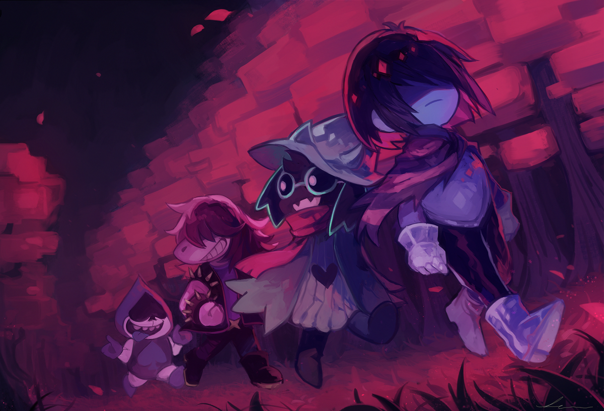

## PARTE 1: IL PLOT PRINCIPALE

Ciao Sabaku! Ne è passato di tempo da quando hai giocato Deltarune. Più precisamente, è nel lontano Novembre 2018 che lo giocasti per la prima volta, a fine 2021 rigiocasti il ch1 seguito dalla blind del ch2! Siccome sono passati parecchi anni, questo sarà un documento che presume che il lettore abbia interagito poco o niente con il gioco e la sua community, quindi andrà parecchio in dettaglio riassumendo ed evidenziando molteplici elementi dei vari capitoli, sottolineando particolari che potrebbero o non potrebbero essere importanti che in ogni caso sarebbero molto più freschi nella mente di un appassionato rimasto aggiornato. Certamente più veloce di rigiocarlo, ma questo documento sarà tutt’altro che una cosa veloce. Saranno inclusi vari link che rimostreranno scene, screenshot, dialoghi e vari, spesso della tua stessa run per ricordare quei momenti in live.

Il plot di deltarune parla di ==Chara== che non scende più nel mondo ma boh fa:

- Cosa 1
- Cosa 2
- Cosa 3

Quindi il plot è incentrato su:

1. Boh l'amicizia
2. Quello che rompe la quarta parete
3. Il bullo

### Subplot

Questo subplot parla di queste cose

AAAA

---

