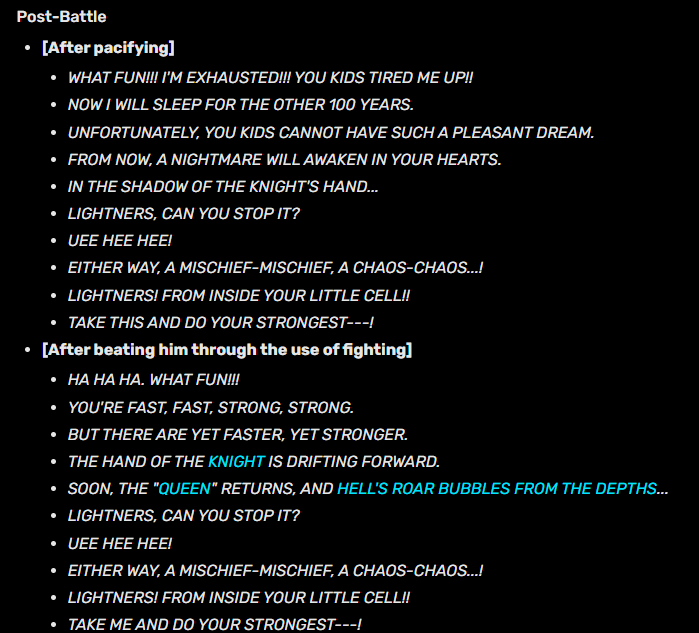
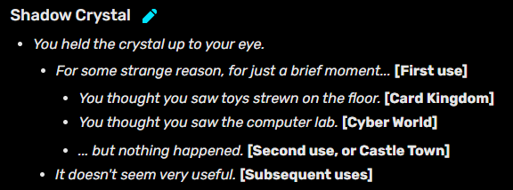
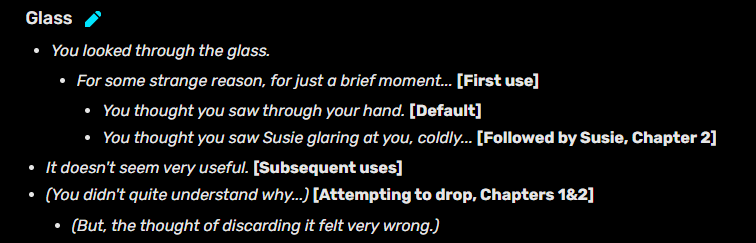

# Super Boss

Entrambi i capitoli presentano due incontri opzionali molto difficili. Partiamo dal primo, Jevil: È possibile incontrarlo prendendo l’ascensore del Castello di Carte verso il piano marcato come “???”. Jevil, da dietro le sbarre parla di come i suoi inseguitori abbiano costruito una prigione intorno al mondo e ora lui sia l’unico ad essere libero, ma in questa libertà si sente solo e vuole aprire la gabbia per fare un “gioco” con il party. Anche rifiutando, ci dirà che stiamo in realtà già giocando. 

Bisogna raccogliere tre pezzi di chiave da riparare. Una di queste e l’unica di cui parlerò è quella che ci da Seam, il quale ci rivela che è stato lui stesso ad imprigionare Jevil (o a imprigionare tutti eccetto Jevil stesso, secondo il punto di vista del giullare) che era un suo vecchio amico, prima che divenisse folle a causa della visita di qualcuno di misterioso. Seam dice che quello che diceva non era completamente sensato, ma neanche completamente insensato, e che la sua visione del mondo da allora è diventata “Darker, yet darker”, il che ci fa dedurre che quella persona misteriosa possa essere Gaster. 

Riparata la chiave, possiamo tornare da Jevil che ci farà finalmente giocare al suo “gioco di numeri”: se i nostri hp si azzerano, perdiamo; molto semplice. Dipendentemente da come viene sconfitto (Tramite gli ACT o il FIGHT), Jevil si trasformerà in uno di due oggetti equipaggiabili (Devilsknife FTW), e darà anche due dialoghi diversi, eccoli qui. 

Ci darà anche uno ShadowCrystal, un oggetto misterioso che se usato nel dark world sembra mostrare il mondo reale, se usato nel light world (dove si chiama semplicemente “Glass”) mostra qualcosa… di diverso. Ecco i dialoghi visibili. 

  

 

Arriviamo a Spamton, che come menzionato prima è un incontro obbligatorio nella trama principale. Dopo averlo sconfitto tramite gli ACT è possibile visitarlo nel suo shop; gli eventi di questo strambo personaggio sembrano profondamente legati a Kris nello specifico. Spamton parla molto di libertà (come Jevil, ma qui il tema è ancor più rilevante) , di liberarsi da un controllo superiore, cosa che sembra (giustamente) interessare molto a Kris.

Infatti insiste per interagire da solo con Spamton, lontano da Ralsei e Susie, fino a quando non interverranno per salvarlo. Alcuni dialoghi che vorrei ricordare sono quelli che menzionano un certo “Mike”, che è semplicemente oggetto di un discorso dove Spamton sostiene di non avere bisogno di lui, e di come ci dice che non ci dobbiamo fidare di quello che “vediamo in tv”, e che “quell’uomo è un criminale”. Forse Mike è l’entità sorridente nella tv a fine capitolo?

Sta di fatto che Spamton chiederà a Kris di recuperare un certo EmptyDisk nel sotterraneo della magione di Queen. Dopo un viaggio abbastanza inquietante (di nuovo, Kris rifiuta la presenza di Susie e Ralsei) e trovato un corpo robotico esanime in cui si trova il disco, Spamton trasferirà la sua essenza in esso, e riportando il disco nel corpo del sotterraneo, Spamton ne prenderà il controllo diventando Spamton NEO.

Qui ci sono due cose da notare: innanzitutto il design è praticamente identico al design di METTATON NEO, la forma “definitiva” di Mettaton della genocide che one-shottiamo, senza neanche avere la possibilità di affrontarlo per davvero, motivo per cui si sente il leitmotiv di quella non-battaglia affrontando Spamton.

Questo viene poi implicitamente confermato dal maggiordomo di Queen, che ci dirà che quel corpo è “l’incarnazione del sogno disegnato da un Lightner” ma è stato abbandonato, probabilmente perché Mettaton non lo ha (ancora) potuto rendere realtà.
La seconda cosa, è che Spamton è pilotato da dei fili da burattinaio. Il che lo sconvolge a tal punto da raggiungere la conclusione che per poter diventare veramente libero, deve prendere l’Anima di Kris. Susie e Ralsei arrivano improvvisamente per salvare l’amico, e inizia la battaglia. Come con Jevil, ha due possibili esiti con due possibili reward: uno se sconfitto con il fight, e l’altro con gli ACT, tagliando i suoi fili. Nessuno dei due esiti finirà per aiutare davvero Spamton ad essere libero, che si trasformerà nell’equip per aiutarci da lì in poi. Ciò evidentemente sconvolge Kris, ma ne parleremo nella sua sezione apposita.

Dopo la sua sconfitta è possibile tornare nei paraggi del suo negozio, e avremo dei nuovi dialoghi da parte dei suoi vecchi colleghi che ci daranno un approfondimento sul suo passato, consiglio di rileggerli (sottolineo che il “Garbage noise” è lo stesso modo con cui viene descritto il suono che suona quando proviamo ad usare il cellulare nel Dark world, e quel suono è profondamente legato a Gaster)
<iframe width="560" height="315" src="https://www.youtube.com/embed/CnrL0YL4JGk?si=hhY5gDyJKc2W3V1z" title="YouTube video player" frameborder="0" allow="accelerometer; autoplay; clipboard-write; encrypted-media; gyroscope; picture-in-picture; web-share" referrerpolicy="strict-origin-when-cross-origin" allowfullscreen></iframe>

Importante nota: Da inizio ch2, Seam inizierà a prendere i ShadowCrystal, e dopo quello di Spamton, avrà qualcosa di molto importante da dire. 

Perché Seam sta collezionando per noi i Shadowcrystal? Come fa a sapere quale sarà il prossimo nemico ad averlo? Perché il Mantello è scomparso e perché è così importante? Una possibile risposta alla prima domanda: nel menù di crafting di Castletown è presente un item “TwistedSword” che richiede come elementi il “ThornRing” ( lo stesso anello necessario per completare la Weird Route) e un certo “PureCrystal”; quest’ultimo è inottenibile a livello ufficiale, ma ottenendolo tramite cheat/mod è possibile leggere la sua descrizione: “The Shadow purified by the cat” ed essendo Seam un gatto plushie, la conclusione sembra abbastanza ovvia.

Concludo questa parte evidenziando un certo leitmotiv musicale che sia Spamton che Jevil possiedono in alcune delle loro ost (specialmente quelle di battaglia). La community lo ha chiamato  <a href="https://vocaroo.com/1dLkd2M8IXWk "> “Freedom leitmotiv” </a>, siccome entrambi i boss girano molto intorno a questa tematica.

<a href="index.html">Torna alla Home</a>
</body>
